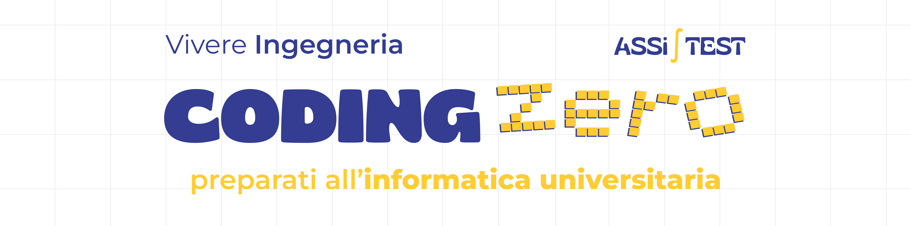

# 🚀 CODING ZERO 2024

Benvenuti alla repository ufficiale di **CODING ZERO**! 🎉

In questa repo troverete tutto il **materiale necessario** per seguire il corso: codice, slide, esercizi e ulteriori risorse. Siamo entusiasti di accompagnarvi in questo viaggio **alla scoperta della programmazione**! 💻

## 📂 Struttura della Repository

La repo è organizzata per facilitare la navigazione tra le varie sezioni del corso. Ecco la **struttura principale**:

```
┌── Codice/                # Tutti i codici sorgente usati durante il corso
│   ├── Lezione 1 - Argomento - Nome Docente/
│   ├── Lezione 2 - Argomento - Nome Docente/
│   └── ...
├── Presentazioni/         # Slide delle lezioni in formato PDF e PowerPoint
│   ├── Lezione 1 - Argomento - Nome Docente/
│   │   ├── Lezione.pdf
│   │   └── Lezione.pptx
│   ├── Lezione 2 - Argomento - Nome Docente/
│   │   ├── Lezione.pdf
│   │   └── Lezione.pptx
│   └── ...
├── Esercizi/              # Esercizi pratici con soluzioni
│   ├── Lezione 1 - Argomento - Nome Docente/
│   │   ├── Esercizi.md
│   │   └── Soluzioni.md
│   ├── Lezione 2 - Argomento - Nome Docente/
│   │   ├── Esercizi.md
│   │   └── Soluzioni.md
│   └── ...
├── Materiale/             # Materiale aggiuntivo (articoli, tutorial, ecc.)
│   ├── Guida.pdf
│   ├── Orario.png
│   └── ...
├── Risorse/               # Risorse utilizzate nella creazione delle slide e della repo
│   ├── Banner.png
│   ├── Sfondo PowerPoint.jpg
│   └── ...
└── README.md              # Il file che stai leggendo ora 😄
```

## 👨‍🏫 Obiettivi del Corso

Il **corso** si propone di fornire una **solida base di programmazione** ai principianti, con un approccio pratico. **Ogni lezione** sarà suddivisa in una **parte teorica e una pratica**. Al termine del corso, **sarai in grado di**:

- Capire i **fondamenti** della **programmazione** (variabili, cicli, funzioni, ecc.)
- Ottenere le **basi dei sistemi GNU/Linux**.
- **Scrivere semplici programmi** in linguaggio C oppure Python
- **Risolvere problemi logici** e strutturare il codice in modo leggibile e manutenibile

## 📝 Come Usare Questa Repo

1. **Scaricare la repository**: Prima di tutto, clona questa repo sul tuo computer:

   ```bash
   git clone https://github.com/tuo_username/CodingZERO-2024.git
   ```

   **Oppure** scaricala in formato zip tramite **"<>Code"** in verde in alto a destra e **"Download ZIP"**

2. **Naviga nelle cartelle**: Vai nella cartella corrispondente alla lezione che stai seguendo per trovare il codice, le slide e gli esercizi.

3. **Segui le istruzioni**: Ogni lezione contiene istruzioni dettagliate su come eseguire il codice e completare gli esercizi.

## 🔗 Risorse Aggiuntive

Per **approfondire alcuni concetti** o temi trattati durante le lezioni, abbiamo creato una **sezione apposita** chiamata **[risorse/](./risorse/)**, dove troverete articoli e tutorial utili.

## 📧 Contatti

Per qualsiasi **dubbio o domanda**, puoi **contattare** gli **insegnanti** del corso:

<table>
  <tr>
      <th>Vincenzo Mazza</th>
      <th>Gianluca Auletta</th>
      <th>Benedetto D'Amico</th>
      <th>Daniele Susino</th>
      <th>Diego Corona</th>
      <th>Gabriele Iovino</th>
  </tr>
  <tr>
      <td></td>
      <td></td>
      <td></td>
      <td></td>
      <td></td>
      <td></td>
  </tr>
  <tr>
      <td>Project manager</td>
      <td>Flowcharts e pseudocodice</td>
      <td>Flowcharts e pseudocodice</td>
      <td>Linux ed opensource</td>
      <td>Linguaggio C</td>
      <td>Linguaggio Python</td>
  </tr>
  <tr>
      <td>
         <a href="https://www.instagram.com/vin.mazza/">Instagram 📸</a><br>
         <a href="https://www.linkedin.com/in/vincenzo-luigi-mazza-a39024329">LinkedIn 👔</a><br>
         <a href="mailto:mzz.vincenzo@gmail.com">Email 📨</a>
      </td>
      <td>
         <a href="https://www.instagram.com/aulettagianluca/">Instagram 📸</a><br>
         <a href="https://it.linkedin.com/in/gianluca-auletta">LinkedIn 👔</a><br>
         <a href="mailto:Auletta2303@gmail.com">Email 📨</a>
      </td>
      <td>
         <a href="https://www.instagram.com/benedetto_damico37/">Instagram 📸</a><br>
         <a href="https://www.linkedin.com/in/benedetto-d-amico-1b9451240">LinkedIn 👔</a><br>
         <a href="mailto:bennyda82@gmail.com">Email 📨</a>
      </td>
      <td>
         <a href="https://www.instagram.com/daniele.susino/">Instagram 📸</a><br>
         <a href="https://www.linkedin.com/in/susinodaniele/">LinkedIn 👔</a><br>
         <a href="mailto:susino.daniele@outlook.com">Email 📨</a>
      </td>
      <td>
         <a href="https://www.instagram.com/diego_co3/">Instagram 📸</a><br>
         <a href="https://www.linkedin.com/in/diegocorona03">LinkedIn 👔</a><br>
         <a href="mailto:corona.diego@outlook.com">Email 📨</a>
       </td>
      <td>
         <a href="https://www.instagram.com/gabriele.iovino_/">Instagram 📸</a><br>
         <a href="https://www.linkedin.com/in/gabriele-iovino-517090243">LinkedIn 👔</a><br>
         <a href="mailto:gabrieleiovino839@gmail.com">Email 📨</a>
      </td>
  </tr>
</table>

---

💡 **Nota**: Questa repository è parte di un corso base di programmazione e il suo **contenuto è destinato a scopi educativi**. Se trovi qualche **errore** o hai **suggerimenti**, **non esitare a segnalarlo**! Buono studio! 😄

Si ringrazia [Storyset](https://storyset.com) per le illustrazioni.
